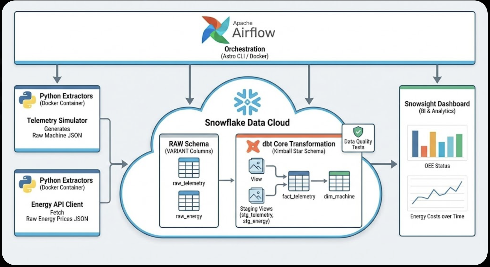
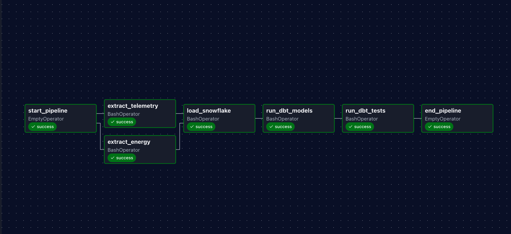
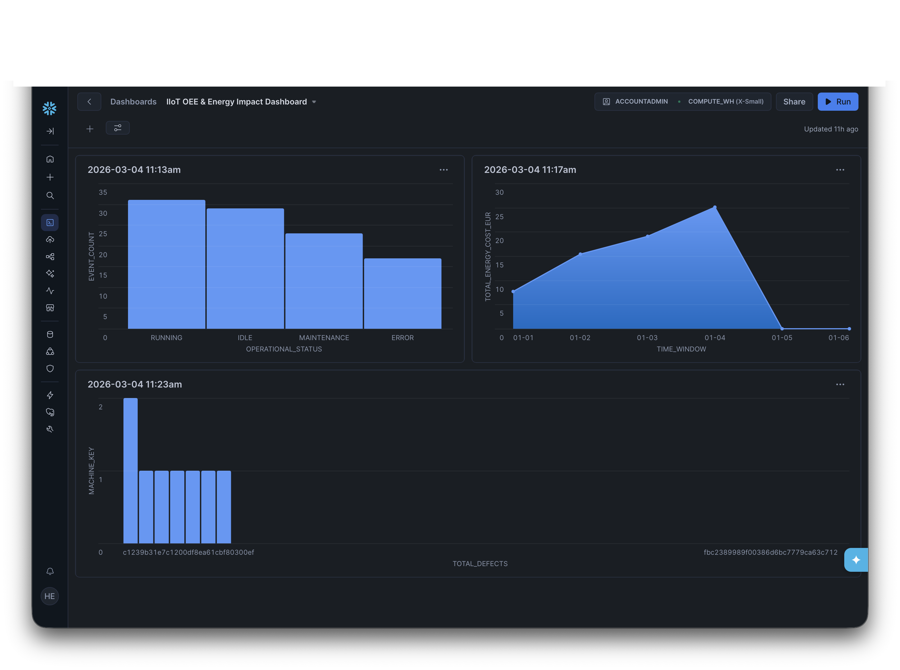

# Industrial IoT & Telemetry Pipeline (Micro-Batch OEE)

An end-to-end, containerized ELT pipeline designed to simulate factory floor machine telemetry, ingest external API energy market data, and model the financial impact of dynamic power grids on Overall Equipment Effectiveness (OEE).

## Business Case
In modern Industry 4.0 environments, calculating OEE is standard. However, in regions with fluctuating energy markets (like Germany), machine downtime isn't just a loss of production—running power-heavy machines during peak grid pricing drastically reduces profit margins. 

This pipeline ingests high-frequency machine telemetry and joins it with Day-Ahead wholesale electricity prices to provide a real-time view of estimated energy costs per machine event.

## Architecture

<details>
  <summary><b>Click to view the Architecture Diagram</b></summary>
  
</details>

### The Modern Data Stack
* **Extraction (Python):** Custom simulators generate realistic factory JSON telemetry. The `requests` library pulls hourly wholesale energy prices from the German SMARD.de REST API.
* **Storage (Snowflake):** Acts as the single-source-of-truth data warehouse. Raw JSON is loaded directly into `VARIANT` columns via the `snowflake-connector-python`.
* **Transformation (dbt Core):** Unpacks semi-structured JSON, enforces data quality tests, and models the data into a Kimball Star Schema (Fact and Dimension tables).
* **Orchestration (Apache Airflow):** Containerized via Astronomer (Astro CLI), Airflow runs the pipeline as a daily micro-batch DAG.
*The fully green execution graph of the ELT pipeline, showing parallel extraction and sequential loading/testing.*

<details>
  <summary><b>Click to view the DAG</b></summary>
  
</details>

* **Presentation (Snowsight):** Dashboards visualize machine status distribution and continuous energy cost metrics.
*The final Business Intelligence dashboard tracking Overall Equipment Effectiveness (OEE) against estimated energy costs.*

<details>
  <summary><b>Click to view the snowsight dashboard</b></summary>
  
</details>

## Repository Structure (Monorepo)

```text
Micro-Batch-OEE-Pipeline/
├── dags/                           # Airflow DAG definition (elt_pipeline_dag.py)
├── include/
│   ├── extract/                    # Python API and Simulator scripts
│   ├── load/                       # Snowflake ingestion scripts
│   └── iiot_transformations/       # dbt Core project (models, tests, schema.yml)
├── Dockerfile                      # Astro CLI image configuration
├── requirements.txt                # Python dependencies (dbt-snowflake, etc.)
└── README.md

⚙️ How to Run Locally
This project uses the Astronomer CLI to spin up a local Airflow environment via Docker.

1. Clone the repository:
git clone [https://github.com/hazemabollfadl/Micro-Batch-OEE-Pipeline.git](https://github.com/your-hazemabollfadl/Micro-Batch-OEE-Pipeline.git)
cd Micro-Batch-OEE-Pipeline

2. Configure your Snowflake Credentials:
Create a .env file in the root directory and add your Snowflake trial credentials:
SNOWFLAKE_ACCOUNT=your_account_locator
SNOWFLAKE_USER=your_username
SNOWFLAKE_PASSWORD=your_password
SNOWFLAKE_DATABASE=IIOT_FACTORY
SNOWFLAKE_SCHEMA=RAW

3. Start the Airflow Cluster:
Ensure Docker is running (OrbStack recommended for Apple Silicon), then run:
astro dev start

4. Trigger the Pipeline:
Navigate to http://localhost:8080 (default credentials: admin / admin). Unpause the iiot_data_pipeline DAG and trigger it manually to watch the ELT process execute!
